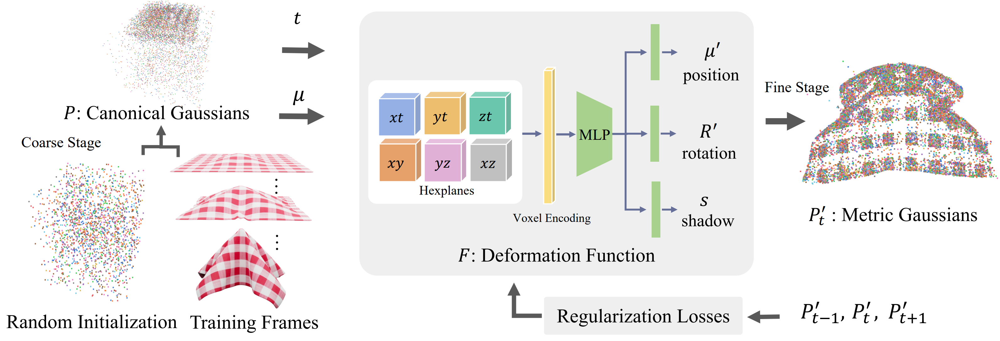

# DeformGS: Scene Flow in Highly Deformable Scenes for Deformable Object Manipulation

## WAFR 2024

### [Project Page](https://deformgs.github.io)| [Paper](https://deformgs.github.io/paper.pdf)

---------------------------------------------------

---

   


## Installation 

**Pull the code**

```
git clone --recursive https://github.com/momentum-robotics-lab/deformgs.git
```

**Conda in Docker**
We use docker to run the code, you will need to install docker and [nvidia-docker](https://docs.nvidia.com/datacenter/cloud-native/container-toolkit/latest/install-guide.html). You can replicate our setup using the following commands:
```
docker pull bartduis/4dgaussians:latest
docker run -it --gpus all --network=host --shm-size=50G  --name deformgs -v /home/username:/workspace bartduis/4dgaussians:latest
conda activate Gaussians4D
cd /workspace 
pip install -e submodules/depth-diff-gaussian-rasterization
pip install -e submodules/simple-knn
pip3 install h5py open3d seaborn
```

**Conda without Docker**
This has not been tested exhaustively, but worked in our testing.

```
conda create -n deformgs python=3.7 
conda activate deformgs

pip install -r requirements.txt
pip install -e submodules/depth-diff-gaussian-rasterization
pip install -e submodules/simple-knn
```

**Docker without Conda**

We also provide a dockerfile and image without Conda.
You can build the docker image by running the following command:
```
docker build -f deformgs.dockerfile -t deformgs .
```

If you don't want to build the docker image, you can pull a pre-built image from docker hub:
```
docker pull bartduis/deformgs:latest
```

Now create a container from the image and run it.
``` 
docker run -it --gpus all --network=host --shm-size=50G  --name deformgs -v /home/username:/workspace deformgs
cd /workspace 
pip install -e submodules/depth-diff-gaussian-rasterization
pip install -e submodules/simple-knn
```
Please let us know if you experience any issues with installing the code, using docker with Conda should be most reliable, this is how we ran the experiments.

## Data from the Paper

We make the data used in the paper available [here](https://cmu.box.com/s/hb2dx2ax8q3ovcwg5kfans3xd5w7d2vq).
Place the downloaded folders in the `deformgs/data/` folder to arrive at a folder structure like this:
```
├── data
│   | robo360 
│     ├── cloth
│     ├── duvet
│     ├── xarm_fold_tshirt
│   | synthetic 
│     ├── scene_1
│     ├── ...
│     ├── scene_6

```

## Training
To train models for all scenes from the paper, run the following scripts.
``` 
./run_scripts/run_all_synthetic.sh
./run_scripts/run_all_robo360.sh
``` 

## Rendering
Run the following script to render images for all scenes. 

```
./run_scripts/render_all_synthetic.sh
./run_scripts/render_all_robo360.sh
```

## How to prepare your dataset?

Follow the readme's in the robo360 submodule [here](robo360/README.md), and in the XMem folder [here](XMem/splatting_README.md).

## Contributions
Some source code of ours is borrowed from [3DGS](https://github.com/graphdeco-inria/gaussian-splatting), [k-planes](https://github.com/Giodiro/kplanes_nerfstudio),[HexPlane](https://github.com/Caoang327/HexPlane), [TiNeuVox](https://github.com/hustvl/TiNeuVox), [4DGS](https://github.com/hustvl/4DGaussians). We appreciate the excellent works of these authors.

## Citation
```
@inproceedings{duisterhof2024deformgs,
      title={DeformGS: Scene Flow in Highly Deformable Scenes for Deformable Object Manipulation}, 
      author={ Bardienus P. Duisterhof, Zhao Mandi, Yunchao Yao, Jia-Wei Liu, Jenny Seidenschwarz, Mike Zheng Shou, Deva ramanan, Shuran Song,
      Stan Birchfield, Bowen Wen, Jeffrey Ichnowski},
      booktitle={The 16th International Workshop on the Algorithmic Foundations of Robotics (WAFR)}
      year={2024},
}
```
